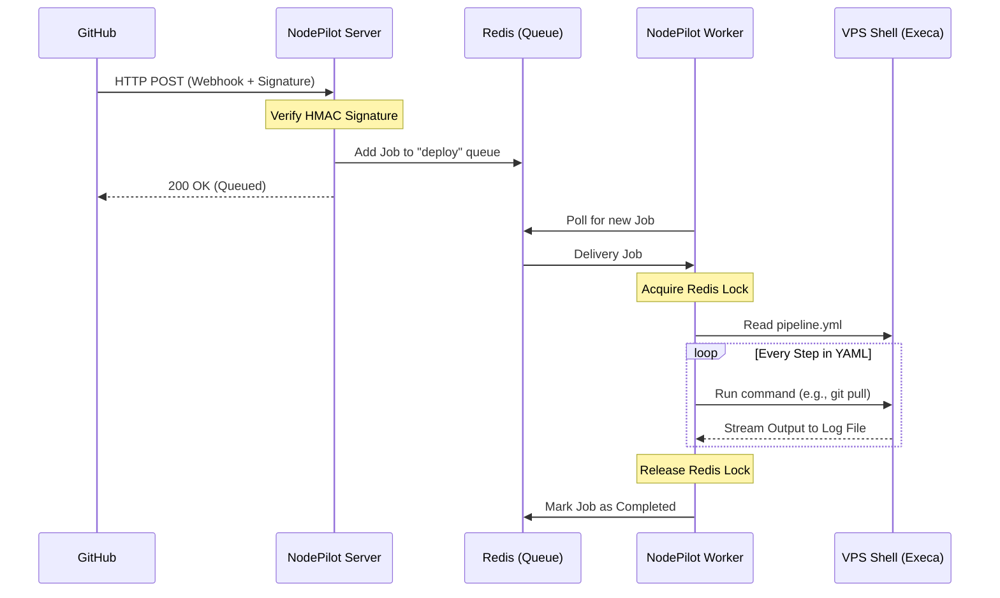

# NodePilot CI/CD

NodePilot is a high-reliability, distributed CI/CD system designed for lightweight and secure deployments on VPS environments. It allows you to automate your MERN stack (or any Node.js) deployments via GitHub Webhooks.

## Prerequisites

Before installing NodePilot, ensure your VPS has the following:

- **Node.js**: v18.x or higher
- **Redis**: Required for the job queue (BullMQ)
- **PM2**: Recommended for process management
- **Git**: For cloning and pulling repositories

## Installation

1. **Clone the Repository**

   ```bash
   git clone https://github.com/your-username/nodePilot.git
   cd nodePilot/server
   ```

2. **Install Dependencies**

   ```bash
   npm install
   ```

3. **Environment Setup**
   Create a `.env` file in the `server` directory:
   ```env
   PORT=7000
   GITHUB_SECRET=your_webhook_secret_here
   REDIS_HOST=127.0.0.1
   REDIS_PORT=6379
   LOG_LEVEL=info
   ```

## Getting Started

1. **Start Redis** (if not already running):

   ```bash
   sudo systemctl start redis
   ```

2. **Start NodePilot with PM2**:
   Use the provided configuration to start both the server and the worker:

   ```bash
   npx pm2 start ecosystem.config.cjs
   ```

3. **Configure GitHub Webhook**:
   - Go to your GitHub repository -> Settings -> Webhooks.
   - Payload URL: `http://your-vps-ip:7000/webhook/github`
   - Content type: `application/json`
   - Secret: (Paste the `GITHUB_SECRET` from your `.env`)
   - Which events: Just the `push` event.

## Architecture Overview

NodePilot handles deployments using a decoupled, queue-based architecture to ensure stability and security.

### How it Works

1. **Webhook Reception**: Fastify receives the request and verifies the HMAC SHA-256 signature using your secret.
2. **Job Queueing**: The deployment task is added to a **BullMQ** queue backed by **Redis**.
3. **Deploy Worker**: A separate worker process picks up the job and executes the pipeline steps.
4. **Pipeline Engine**: Reads `pipelines/pipeline.yml` and executes commands using **Execa**.

## Visual Flow



## Security & Reliability

- **Atomic**: Redis locks prevent concurrent workers from corrupting the same directory.
- **Persistent**: Jobs survive crashes thanks to Redis backing.
- **Cryptographic**: All incoming requests are verified via GitHub signatures.
