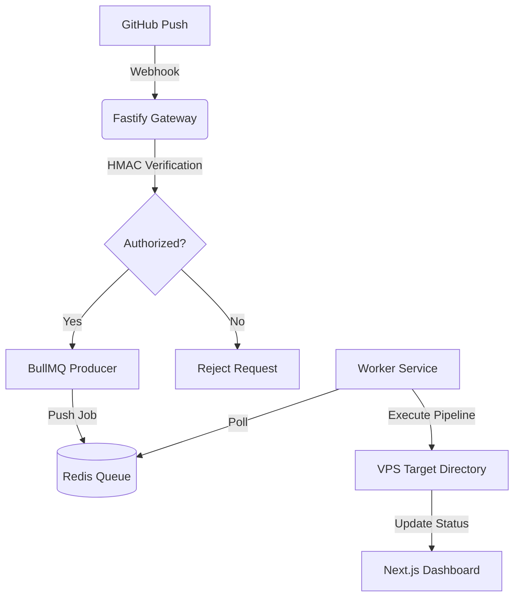
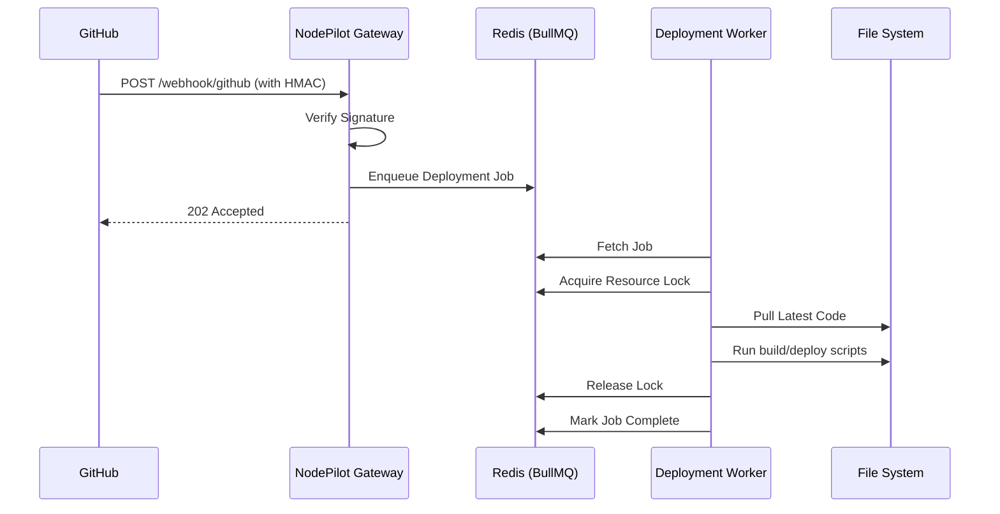

<div align="center">
  
  <h1>🚀 NodePilot CI/CD</h1>
  <p><strong>High-reliability, distributed CI/CD system designed for lightweight and secure deployments.</strong></p>

[](https://opensource.org/licenses/MIT)
[](https://nodejs.org/)
[](https://redis.io/)
[](https://github.com/your-username/nodePilot/graphs/commit-activity)

</div>

---

## 📖 Overview

NodePilot is a distributed CI/CD engine built to streamline deployments on VPS environments. It solves the complexity of manual deployments by providing a robust, queue-based architecture that ensures every push to GitHub is handled with precision, security, and full traceability.

> [!IMPORTANT]
> NodePilot is designed for performance. By decoupling the webhook listener from the deployment execution, it achieves near-zero downtime for the deployment pipeline itself.

---

## ✨ Key Features

- **🛡️ Secure Triggers**: Uses HMAC SHA-256 signature verification for all GitHub Webhooks, preventing unauthorized deployment attempts.
- **⛓️ Async Job Queue**: Powered by **Redis** and **BullMQ**, ensuring jobs are persisted and executed reliably even under load.
- **🔒 Concurrent Safety**: Implements a distributed locking mechanism using Redis to prevent overlapping deployments on the same resource.
- **📊 Real-time Dashboard**: A premium Next.js dashboard to monitor job status, view deployment logs, and manage projects.
- **📜 Atomic Logging**: Every deployment step is captured in detailed, job-specific logs for easy debugging.
- **⚡ High Performance**: Built on **Fastify** for the fastest possible webhook ingestion.

---

## 🏗️ Architecture

NodePilot employs a modern, decoupled architecture to separate concerns and maximize reliability.

### 1. High-Level Flow



### 2. Deployment Sequence



---

## 🛠️ Technical Implementation

### Distributed Locking

To prevent race conditions where multiple pushes might trigger simultaneous deployments for the same repository, NodePilot uses a **Redis-based locking mechanism**. Before any worker starts a task, it must acquire a unique lock identified by the repository URI.

### Secure Webhooks

Security is paramount. NodePilot doesn't just trust incoming requests. Every payload is validated using the `x-hub-signature-256` header from GitHub, ensuring that only triggers from your authorized repositories can initiate a deployment.

---

## 🖥️ Dashboard Showcase

NodePilot comes with a sleek, modern dashboard built with **Next.js 15**, **Tailwind CSS**, and **Framer Motion**.

- **Live Activity**: Monitor incoming webhooks and active deployments.
- **Log Terminal**: View live streaming logs from your deployment workers.
- **Project Management**: Configure repositories and environment variables on the fly.

---

## 🚀 Getting Started

### Prerequisites

| Tool        | Version | Purpose             |
| :---------- | :------ | :------------------ |
| **Node.js** | v18.x+  | Runtime Environment |
| **Redis**   | v6.x+   | Job Queue & Locking |
| **PM2**     | Latest  | Process Management  |

### Installation

1. **Clone & Setup**

   ```bash
   git clone https://github.com/your-username/nodePilot.git
   cd nodePilot/server
   npm install
   ```

2. **Environment Configuration**
   Create a `.env` in the `server` directory:

   ```env
   PORT=7000
   GITHUB_SECRET=your_secure_secret
   REDIS_HOST=127.0.0.1
   REDIS_PORT=6379
   ```

3. **Launch NodePilot**
   ```bash
   npx pm2 start ecosystem.config.cjs
   ```

---

## 🤝 Contributing

Contributions are what make the open-source community such an amazing place to learn, inspire, and create. Any contributions you make are **greatly appreciated**.

1. Fork the Project
2. Create your Feature Branch (`git checkout -b feature/AmazingFeature`)
3. Commit your Changes (`git commit -m 'Add some AmazingFeature'`)
4. Push to the Branch (`git checkout origin feature/AmazingFeature`)
5. Open a Pull Request

---

<div align="center">
  <p>Built with ❤️ by Hemant Jadhav</p>
</div>
